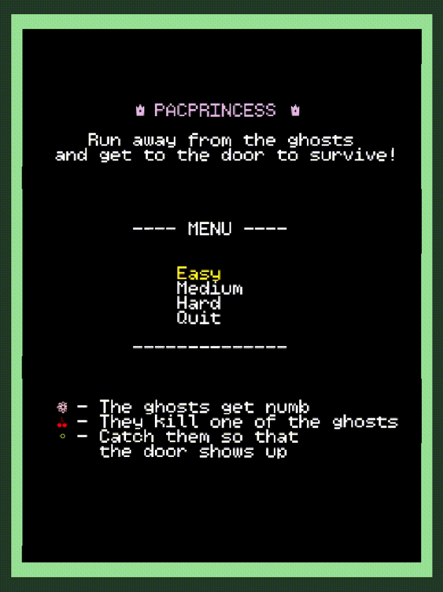

# Projeto de Avaliação
## Laboratório de Teste e Design de Software
### 1º Semetre, 2º ano, 2022/2023

  

- Membros:
  - Carolina Viana
  - Guilherme Monteiro
  - Sofia Sá

O nosso projeto tem o nome “PacPrincess” e funciona como um spin-off do tradicional jogo Pacman.
O objetivo do nosso jogo é ajudar a Princesa a escapar da floresta assombrada do seu castelo e a chegar ao seu destino final - a porta de saída. Contudo, no seu percurso, encontra algumas adversidades. A Princesa vai ser perseguida por fantasmas, mas conta com a ajuda de flores e cerejas para poder escapar. Tem também de apanhar todas as moedas da floresta para fugir!

- Classificação:
  - 17.2

Ver relatório completo para todos os detalhes/explicações [aqui](docs/README.md).

### Demo

