## LDTS_T08G06 - PACPRINCESS

O nosso projeto tem o nome “PacPrincess” e funciona como um spin-off do tradicional e conhecido jogo Pacman. O objetivo do nosso jogo é ajudar a Princesa a escapar da floresta assombrada do seu castelo e a chegar ao seu destino final - a porta de saída. Contudo, no seu percurso, encontra algumas adversidades que tornam a tarefa desafiante! A Princesa pode cruzar com fantasmas que a podem apanhar (e fazê-la perder o jogo) e dois tipos de objetos coletáveis - os objetos que a ajudam a escapar aos fantasmas (flores e cerejas) e os objetos que ela tem, de facto, de adquirir para que possa escapar da floresta (as moedas).

Este projeto foi desenvolvido por Carolina Viana (up202108802@fe.up.pt), Guilherme Monteiro (up202108668@fe.up.pt) e Sofia Sá (up202108676@fe.up.pt) para LDTS 2022/23.

### IMPLEMENTED FEATURES
- Personagem controlada (Princesa);
- A Princesa começa o jogo no seu “start point”, com zero moedas colecionadas;
- Existe 1 mapa para cada um dos 3 níveis de dificuldade à escolha do user, com diferente tamanho, complexidade e número de objetos colecionáveis;
- Existem 4 tipos de fantasmas com características (movimentos, cores, estratégias, ...) diferentes que se movem pelo mapa e que podem caçar a Princesa;
- Cerejas que a Princesa pode apanhar e que retiram um fantasma do mapa (aleatoriamente escolhido) (****3****);
- Flores que a Princesa pode apanhar e que imobilizam temporariamente (10s) os fantasmas (****4****);
- Moedas que a Princesa tem que apanhar para que apareça a porta do mapa, permitindo-a assim chegar ao destino final e escapar ao labirinto assombrado;
- Um menu inicial com o título do jogo e com as opções: “Easy”, “Medium” e “Hard” (as opções de dificuldade do mapa a escolher), “Quit” (para sair do jogo) e uma pequena descrição informativa acerca dos elementos do jogo para utilizadores que nunca tenham jogado o jogo (****1****);
- Um menu secundário chamado “Paused” com as opções: "Resume" (retomar o jogo), “Go back to Menu” (voltar ao menu inicial) e “Quit game” (sair do jogo) (****2****);
- Outro menu secundário chamado "Game Over/ Win" quando a princesa é apanhada por um fantasma com as opções: “Go back to Menu” (voltar ao menu inicial) e “Quit game” (sair do jogo)(****5****,****7****);
- Quando a Princesa apanhou todas as moedas no mapa, a porta para escapar aparece no mapa e esta ganha o jogo, quando chega a ela (****6****,****7****);
- Quando a Princesa é apanhada por um fantasma perde o jogo (****5****);
- Diferentes efeitos sonoros para cada momento: Menu, Jogo em andamento, Game over, Paused e nos momentos em que a personagem apanha os diferentes elementos do mapa (moedas, flores ou cerejas);
- Capacidade de leitura de mapas fornecidos pelo user. Possibilidade de costumizar mapas.

#### DEMOS DAS PRINCIPAIS FEATURES
| Notas | Demos                         |
|-------|-------------------------------|
| 1     | [Menu](Gifs/InitTerminal.gif) |
| 2     | [Pause](Gifs/PauseDemo.gif)   |
| 3     | [Cherry](Gifs/CherryDemo.gif) |
| 4     | [Flower](Gifs/FlowerDemo.gif) |
| 5     | [GameOver](Gifs/GameOver.gif) |
| 6     | [Door](Gifs/OpenDoor.gif)     |
| 7     | [Win](Gifs/Win.gif)           |

#### MAPAS

**Easy**

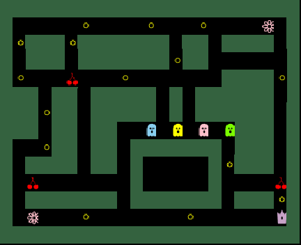

**Medium**

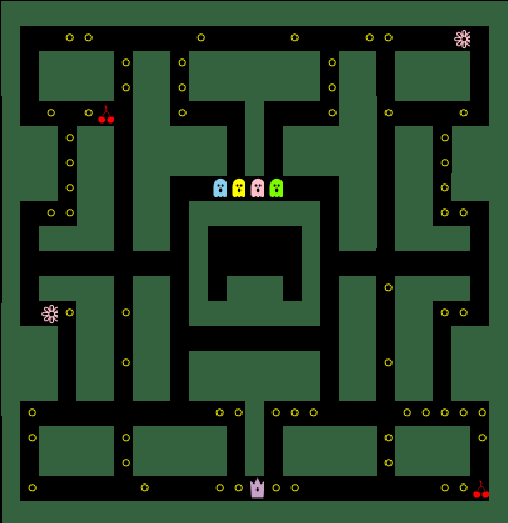

**Hard**

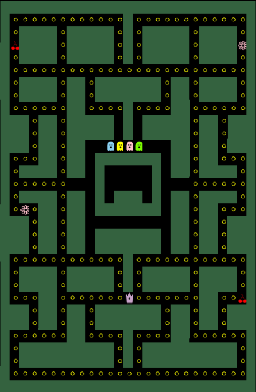

### DESIGN
#### ARCHITECTURAL PATTERN - MVC

**Problema em contexto:**
Dividir o jogo em vários packages, cada um responsável por uma "área diferente", de forma a que cada um assuma apenas uma responsabilidade. 

**O Pattern:**

O design pattern aplicado será o **Model View Controller** pattern, que separa as classes do jogo em três partes, uma responsável por guardar os dados (***Model***), outra por mostrá-los ao utilizador (***View***) e outra por controlá-los de forma a fazer o jogo avançar (***Controller***). A View faz a conexão entre o utilizador e o Controller, pois envia as ações do jogador a este. É o Controller que faz a ponte entre o Model e a View, ao ser responsável por fornecer os dados para serem renderizados; interpreta as ações do utilizador.

**Implementação:**

A seguinte imagem mostra como as tarefas do pattern foram mapeadas para as classes da aplicação.
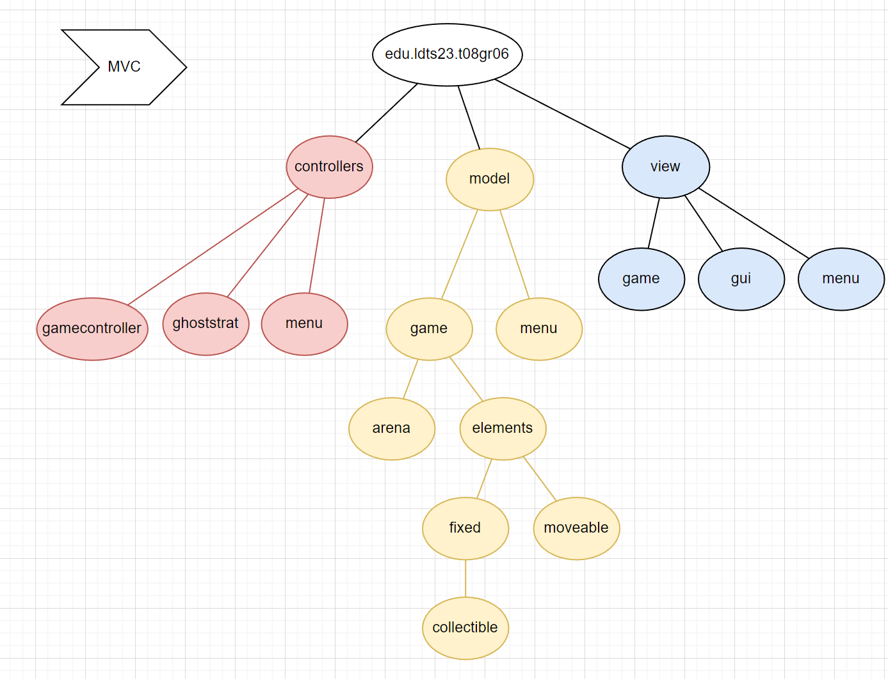

**Consequências**

- Este pattern permite uma melhor organização do Jogo, ao dividir as classes em packages.
- Facilita eventuais modificações/adições consequentes ao jogo.  
- Também garante independência entre packages e classes, minimizando o "coupling between classes"
- Por fim, facilita a testagem do jogo.

****Em suma, este padrão arquitetural foi o que mais nos ajudou na organização do jogo e o fator que mais nos fez atentar na divisão de Responsabilidades entre classes.****

#### ESTADO DO JOGO
**Problema em contexto:**

O nosso jogo tem 4 estados – o Menu inicial, o Jogo em andamento, o Menu Secundário (“Paused”) e Menu final ("GameOver/Win"). Dependendo de onde o utilizador estiver precisamos que a nossa aplicação se comporte de maneira diferente. 
De facto, o nosso jogo terá diferentes Estados consoantes as ações do jogador. Desta maneira, é necessário gerir os diferentes estados e alternar entre eles de uma forma que não viole Princípios SOLID.

**O Pattern:**

O design pattern aplicado será o **State** pattern, que implica a criação de diferentes subclasses para cada estado diferente do jogo, extraindo para essas sublcasses todos os comportamentos e dados específicos desse estado.
O nosso Jogo (Class [Game](../src/main/java/edu/ldts23/t08gr06/Game.java)) tem um Estado inerente (atributo State) e, ao longo da jogada, vai alternando entre [States](../src/main/java/edu/ldts23/t08gr06/states/State.java). Isto torna-se possível apenas porque todos os estados têm uma superclasse comum.

**Implementação:**

A seguinte imagem mostra como as tarefas do pattern foram mapeadas para as classes da aplicação.
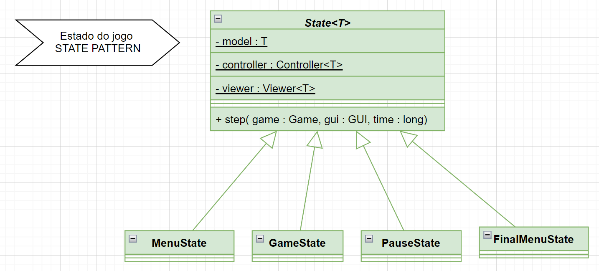

**Consequências**

- O padrão permite-nos alterar facilmente o comportamento do jogo em ****Runtime****, ao alternar por diferentes Estados.
- Single Responsability Principle: Cada estado é responsável apenas pelo seu comportamento.
- Open Closed Principle: Conseguiríamos muito facilmente e rapidamente adicionar mais Estados aos jogo, caso fosse necessário. Apenas criávamos mais subclasses de Estado e definíamos o seu comportamento.

****Em suma, este padrão facilitou muito a evolução do nosso jogo, nomeadamente quando o quisemos tornar mais complexo através da adição de um PauseState e de uma MenuState. Verificamos que, de facto, 
adicionar mais Estados se tornou uma tarefa bastante mais simples.****

#### ESTRATÉGIAS DOS FANTASMAS

**Problema em contexto:**

Cada fantasma do jogo adota uma estratégia diferente ao perseguir a Princesa, conforme explicitado anteriormente. Note se que, no nosso jogo, não há necessidade de alterar as Estratégias entre fantasmas em runtime.

**O Pattern:**

O design pattern aplicado será o **Strategy** pattern, que nos permite criar várias estratégias distintas e atribuí-las a instâncias diferentes da classe [Ghost](../src/main/java/edu/ldts23/t08gr06/model/game/elements/moveable/Ghost.java). 
Inicialmente, criamos 4 subclasses de Ghost - Ghost1, Ghost2, Ghost3, Ghost4. No entanto, apercebemo-nos de que a única coisa que diferenciava estas 4 subclasses, era o seu comportamento ao perseguir a 
Princesa (e a sua renderização). Isto é uma má prática e criava bastantes Code Smells, nomeadamente Lazy Class, Duplicate Code, entre outros. Assim, após a aplicaçõa do pattern, temos apenas uma classe Ghost, que recebe 
diferentes [estratégias](../src/main/java/edu/ldts23/t08gr06/controllers/gamecontroller/GhostStrat.java). Desta maneira, conseguimos com que as 4 instâncias de objetos Ghost no nosso jogo se comportem de formas diferentes, sem termos de poluir o nosso código com subclasses desnecessárias.

**Implementação:**

A seguinte imagem mostra como as tarefas do pattern foram mapeadas para as classes da aplicação.
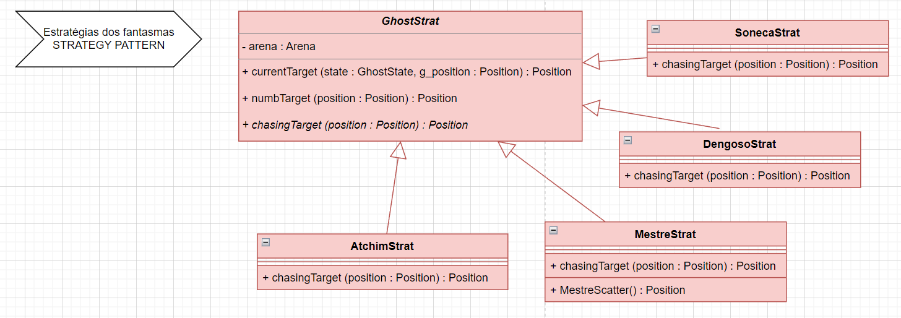

**Consequências**

- Esta solução permitirá aos vários fantasmas adotar diferentes estratégias de forma mais eficiente, evitando Code Smells.
- Open Closed Principle: Conseguimos muito facilmente criar novas estratégias, sem termos de alterar código.
- Single Responsability Principle: Separação de Responsabilidade entre classes. Separamos da class Ghost a definição da sua própria estratégia, atribuindo essa responsabilidade à class GhostStrat.
- Torna-se possível alterar entre estratégias em runtime. Não planeamos fazer isto, mas é útil termos essa possibilidade
- Isolação e abstração da implementação de cada algoritmo de perseguição.

#### LOOP DO JOGO

**Problema em contexto:**

Queriamos que o jogo avance "sozinho", independentemente do jogador estar a intervir ou não. Dessa forma, é necessário que os Fantasmas se movam sozinhos, com o avanço sistemático do jogo.

**O Pattern:**

O design pattern aplicado será o **Game Loop** pattern, que permitirá ao jogo atualizar-se automaticamente, X vezes por segundo.

**Consequências**

- Atualização organizada e sistemática do jogo.
- Simplicidade de código - É fácil fazer com que o jogo se atualize mais rápido ou mais devagar.

#### MÚSICA DO JOGO
**Problema em contexto:**

Para melhorar a experiência do utilizador, decidimos adicionar música ao nosso jogo. Escolhemos uma música diferente para cada estado. Inicialmente, para implementarmos isto, cada Estado tinha uma Música como atributo e cabia ao Controller do jogo
iniciar e parar as músicas ao alternar entre estados. Logicamente, isso viola o Single Responsability Principle, dado que estamos a atribuir responsabilidades acrescidas ao Controlador (mudar músicas) e aos Estados.

**O Pattern:**

O design pattern aplicado será o **Observer** pattern. Este padrão permite que uma lista de Observers seja notificada a determinado momento e se altere conforme definido. No nosso jogo, a classe [Music](../src/main/java/edu/ldts23/t08gr06/sound/Music.java) surge como observador da classe [Game](../src/main/java/edu/ldts23/t08gr06/Game.java) - a nossa main class -
e, cada vez que o State do Game é alterado, o Observer é notificado e updated. Este update é tão simples quanto mudar a música que está a tocar, consoante o estado para o qual passamos. Apesar de no nosso caso, só termos um Observer e não uma lista deles,
o pattern continua a ter o efeito pretendido.

**Implementação:**

A seguinte imagem mostra como as tarefas do pattern foram mapeadas para as classes da aplicação.
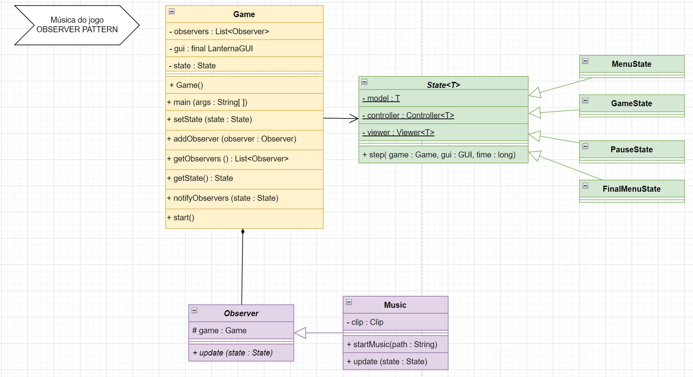

**Consequências** 

- Single Responsability Principle: Evitamos atribuir a responsabilidade de alterar música a outras classes
- Open Closed Principle: Conseguiríamos muito facilmente e rapidamente adicionar mais Observers, caso fosse necessário ter mais coisas a atualizar consoante o Estado do jogo.
- Simplicidade de código: Antes de termos implementado o Pattern, as diferentes classes de controladores tinham código muito mais complexo, visto que estavam constantemente a parar e iniciar diferentes músicas. Com este padrão o código está muito mais organizado e compacto.

#### ELEMENT VIEWERS
**Problema em contexto:**

Inicialmente, para renderizar os diferentes Elementos do nosso jogo, criamos um ElementViewer distinto para cada Elemento (várias subclasses de ElementViewer). Devido à complexidade do nosso jogo, isso traduziu-se
num enorme número de subclasses que apenas diferiam nos caracteres e cores com que os Elementos eram desenhados. Assim, não queríamos ter de criar objetos de classes diferentes para cada Elemento a ser desenhado, mas sim que uma só classe soubesse que Viewer criar.

**O Pattern:**

O design pattern aplicado será o **Factory** method. Este padrão elimina a necessidade de criar inúmeras Classes específicas aos nossos Produtos e, em vez disso, os Objetos são criados dentro de um método pertencente a uma classe Criadora.
Neste caso, utilizamos Templates para evitar ter de criar subclasses da nossa classe Criadora. Assim, o nosso [GameViewer](../src/main/java/edu/ldts23/t08gr06/view/game/GameViewer.java) sabe precisamente que tipo Concreto de produto criar (ou [GhostViewer](../src/main/java/edu/ldts23/t08gr06/view/game/GhostViewer.java) ou [ElementViewer](../src/main/java/edu/ldts23/t08gr06/view/game/ElementViewer.java)).

**Implementação:**

A seguinte imagem mostra como as tarefas do pattern foram mapeadas para as classes da aplicação.
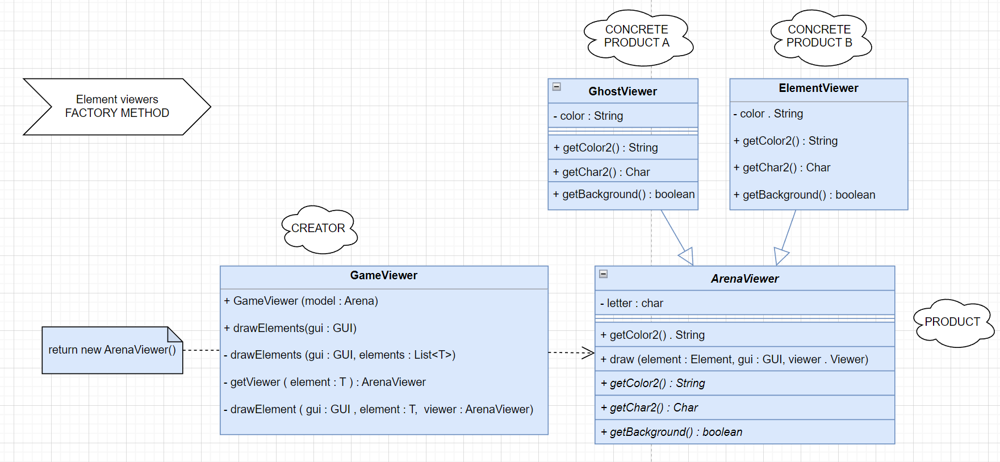

**Consequências**

- Loose-Coupling: Elimina a necessidade de ter classes específicas ao jogo no código, isto é, se houver a necessidade de alterar a renderização de Elementos, não teríamos de eliminar/fazer alterações a várias Classes, mas apenas a um método da nossa class GameViewer
- Open Closed Principle: Podemos introduzir facilmente novos Viewers, sem termos de fazer muitas alterações.

#### FACTORY METHOD
**Problema em contexto:**
Ao definirmos os diferentes Estados para o nosso jogo, era necessário que os diferentes Estados criassem diferentes instâncias de [Viewers](../src/main/java/edu/ldts23/t08gr06/view/Viewer.java) e [Controllers](../src/main/java/edu/ldts23/t08gr06/controllers/Controller.java).

**O Pattern:**

O design pattern aplicado será o **Factory** method. Este padrão faz com que a superclasse State permita às suas subclasses (os diferentes Estados) especificar os Objetos (Viewers e Controllers) que têm de criar.

**Implementação:**

A seguinte imagem mostra como as tarefas do pattern foram mapeadas para as classes da aplicação.
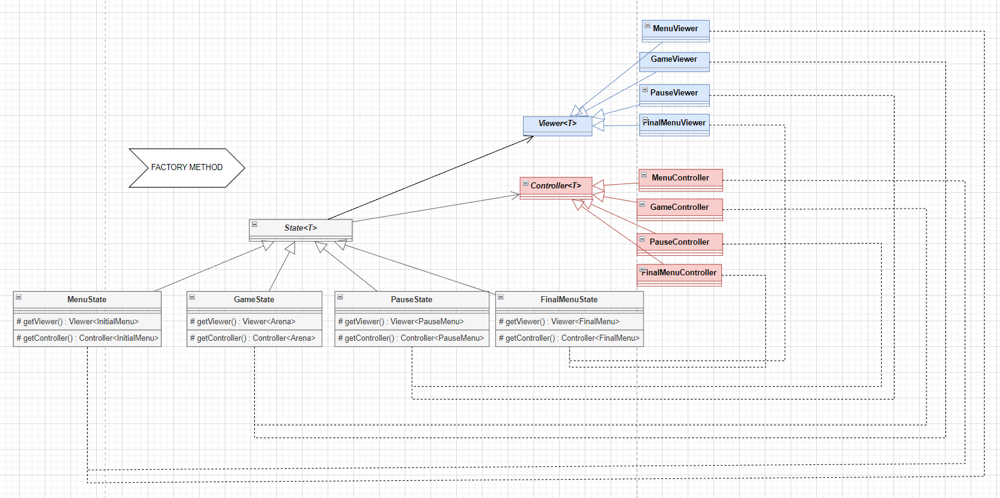

**Consequências**

- Open Closed Principle: Ao introduzir novos Estados, podemos introduzir facilmente novos Viewers e Controller, sem termos de fazer muitas alterações.

#### OUTRAS ESCOLHAS DE DESIGN

Ao longo do projeto, fizemos outras escolhas de design (não involvendo design patterns) relevantes, nomeadamente:

- Inicialmente, pensamos implementar um State Pattern para o Estado dos Ghosts (NUMB e CHASING). No entanto, como são apenas dois estados e um deles (NUMB) não tem uma definição muito complexa (o Fantasma apenas deixa de perseguir a Princesa), concluímos que não implementar o Pattern não iria necessariamente causar muitos Code Smells no nosso código. Assim, optamos por passar um atributo [GhostState](../src/main/java/edu/ldts23/t08gr06/model/game/elements/moveable/GhostState.java) (classe enumeração) aos objetos Ghost e, ao definir as suas estratégias, ter esse estado em consideração.
- Inicialmente, era o [GameController](../src/main/java/edu/ldts23/t08gr06/controllers/gamecontroller/GameController.java) que controlava todos os Collectibles. No entanto, isso adicionava responsabilidades a esta classe e, por isso, decidimos implementar um [Controller](../src/main/java/edu/ldts23/t08gr06/controllers/gamecontroller/CollectiblesController.java) específico para todos os Collectibles, visto que estes têm comportamento disitinto e relevante para o jogo. Nesse Controller, definimos um step especial para a Flower, que coloca os Fantasmas a NUMB, conta 10 segundos, e volta a pô-los a CHASING. O outro step do Controller controla os restantes Collectibles, alterando o model quando necessário.
- Outra questão com que nos deparamos foi relativa ao Menu de Pause. Queríamos que, ao retomar o jogo, ele partisse do ponto de onde paramos. Assim, a classe [PauseMenu](../src/main/java/edu/ldts23/t08gr06/model/menu/PauseMenu.java) tem um atributo State, que recebe o estado do jogo antes de o termos pausado, para que seja possível retomá-lo.

#### UML

Pode-se consultar o UML completo [aqui](UMLDiagrams/UMLFinal.png).

### LISTA DE REFACTORINGS

Ao longo do projeto, procedemos a vários Refactorings que tornaram o nosso código menos Smelly.

- Apagamos todos os comentários, pois o nosso código tornou se percetível o suficiente.
- GhostStrat: Inicialmente era a função ChasingTarget() que verificava o Estado do Fantasma e definia o Target. Percebemos que parte do código era muito semelhante para todas as estratégias e que havia muitos if/switch statements um pouco confusos. Procedemos a um ****Pull Up Method**** criando uma Superclasse e a um ****Extract Method****, separando parte desse código para uma função própria, que é Overridden nas Subclasses (visto que era a única parte do código que mudamos). 
  - Assim, é a função currentTarget() que verifica o Estado do Fantasma e, caso este esteja CHASING, chama a função chasingTarget() que retorna o alvo a perseguir (e é overriden para as diferentes estratégias).
- ****Replace constructor with Factory Method****: Como explicado anteriormente, nos ElementViewers, substituímos os vários constructors por um Factory Method que nos cria o Objeto que necessitamos. Isto permitiu reduzir o número de if/switch statements significativamente e simplificar em muito o código.
- GhostSubclasses: Procedemos a um ****Collapse Hierarchy****, como mencionado anteriormente. No ínicio tínhamos várias subclasses de Ghosts que em praticamente nada diferiam da sua superclass. Assim, eliminamos essas subclasses e optamos por distinguir os Ghosts de outras maneiras.
- MenuController: Simplificamos if clauses na função step(). Inicialmente, tinhamos um switch case para todos as entradas que podíamos selecionar ("Easy", "Medium" e "Hard") que criava o mapa consoante. Conseguimos reduzir a 2 linhas de código, substituindo o algoritmo por outro mais simples (****Decompose Conditional**** ). Fizemos algo semelhante para os controllers dos outros menus, tirando partido do facto de sabermos quais as entradas possíveis de selecionar.

Logicamente, fizemos muitos mais pequenos Refactorings, de modo a melhorarmos continuamente o nosso código, nomeadamente: Extract Methods, Substitute Algorithm, Rename Method, Add/Remove Parameter, Extract Superclass, entre outros. Por serem pequenos, não iremos realçar da mesma maneira.

### CODE SMELLS E SUGESTÕES DE REFACTORING

#### 1. Bloaters - Large Class:
- [Arena](../src/main/java/edu/ldts23/t08gr06/model/game/arena/Arena.java) Class - A classe Arena tem muitos métodos, atributos e linhas de código. 
  - ****Sugestão de Refactoring****: Poderíamos dividir as funcionalidades desta class e delegá-las a outras classes, através de um Extract Class.

#### 2. Couplers - Message Chains
- Nos vários Controllers e nas GhostStrats, para verificar colisões, direções e fazer cálculos tivemos de recorrer, várias vezes, a Chains de funções longas e complexas de entender.
  - ****Sugestão de Refactoring****: Extract Variable e eventualmente Remove Middle Man, alterando as funções bases
  - 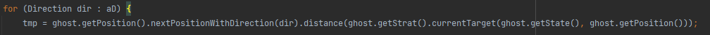

#### 3. Dispensables - Lazy Class
- Nos Elements do jogo, várias subclasses não têm grandes funções e são praticamente iguais à sua Superclass.
  - ****Sugestão de Refactoring****: Poderíamos proceder a um Collapse Hierarchy, e reduzirmos as classes apenas à sua Superclass.
  - ****Nota Relevante****: Com efeito, este foi um Refactoring que ponderamos seriamente fazer. No entanto, optamos por incluir as subclasses pois permitirnos-ia adicionar novas propriedades e features aos Colletibles, bem como acrescentar novos tipos de Collectibles, caso pretendessemos (Open Closed Principle).
    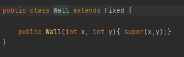

    
### TESTES

#### Code Coverage

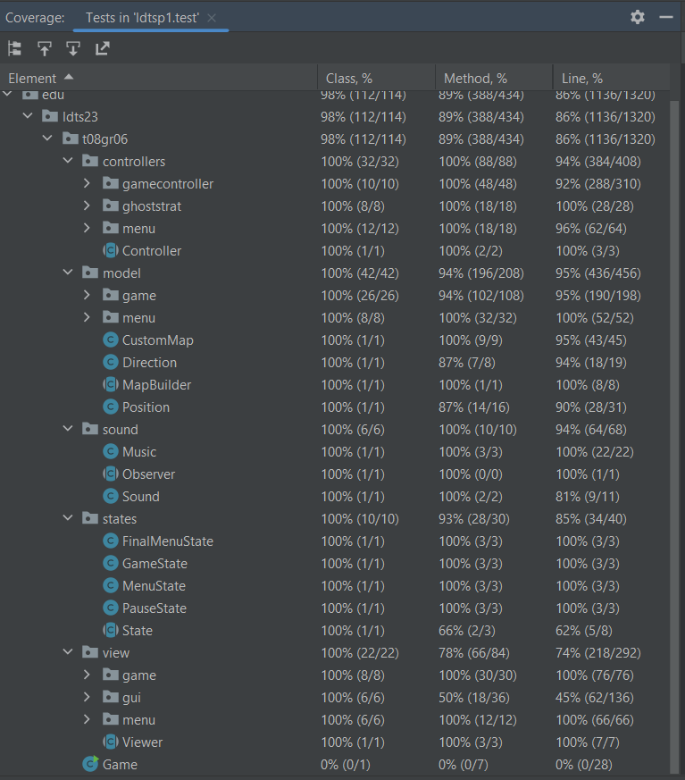

#### Mutation Testing

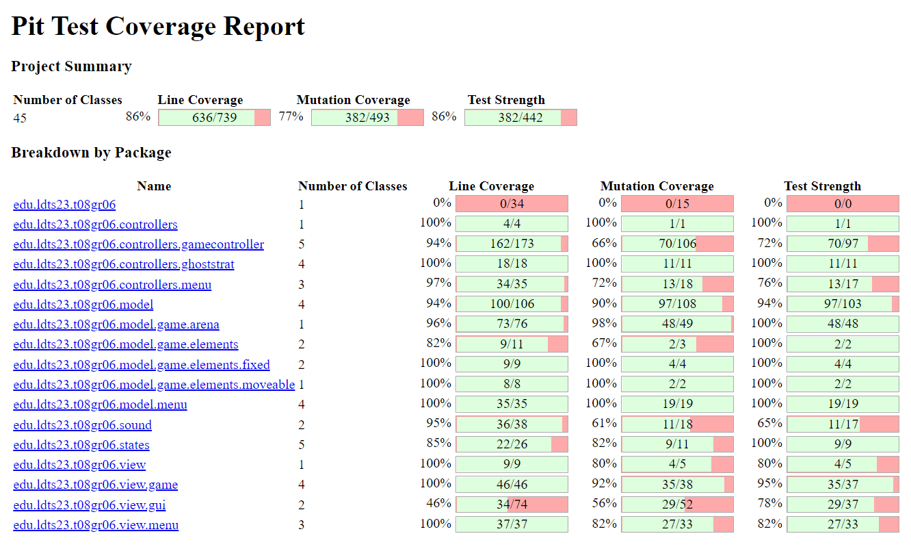

### AUTO-AVALIAÇÃO INICIAL

Foi decidido o tema e parte do modelo do projeto em conjunto. Para esta primeira entrega, o Guilherme Monteiro e a Carolina Viana iniciaram o projeto e a escrita do código. A Sofia Sá esteve em viagem e apenas se reuniu mais tarde, onde colaborou na parte escrita do relatório. Todos contribuíram para discussão de ideias, resolução de problemas e estudo de design patterns e code smells.
As sessões de desenvolvimento foram sobretudo feitas com o recurso ao "Code with me" e por essa razão, é possível notar-se a disparidade no número de commits entre os vários participantes do projeto.

### AUTO-AVALIAÇÃO FINAL

As sessões de desenvolvimento permaneceram sobretudo com o recurso do "Code with me", contudo foi acrescentado a nota de "co-authored by", mostrando assim a colaboração de todos os membros do grupo.

De forma geral, todos contribuíram para cada parte do trabalho, mas atribuímos tarefas mais específicas a cada membro para que o trabalho evoluísse mais eficientemente:

A Carolina Viana desenvolveu os Controllers do jogo principal, definiu as GhostStrategies, adição de sons e música incluindo o Observer Pattern, Factory Pattern referente aos ElementViewers, UnitTests, porção do relatório referente aos Pattern, Refactorings e CodeSmells, criação da Font usada no jogo.

A Sofia Sá e o Guilherme Monteiro tiveram o trabalho mais focado no desenvolvimento dos diferentes menus e respetivos Controllers. informação disposta e aspeto visual, criação de mapas e divisão da sua dificuldade.

A Sofia Sá desenvolveu o diagrama UML e criou pequenos UMLs para a descrição dos design patterns do relatório e tratou da limpeza do código. O Guilherme Monteiro criou os gifs/demonstração para o relatório.

Os Mutation Tests foram desenvolvidos pela Carolina Viana e o Guilherme Monteiro, bem como a melhoria dos testes existentes, com base nas sugestões do PITest.

Todos os elementos contribuiram para as correções e melhorias do código sugeridas pelo error-prone.

O relatório foi desenvolvido por todos, bem como refactorings pontuais para melhoria do código.

